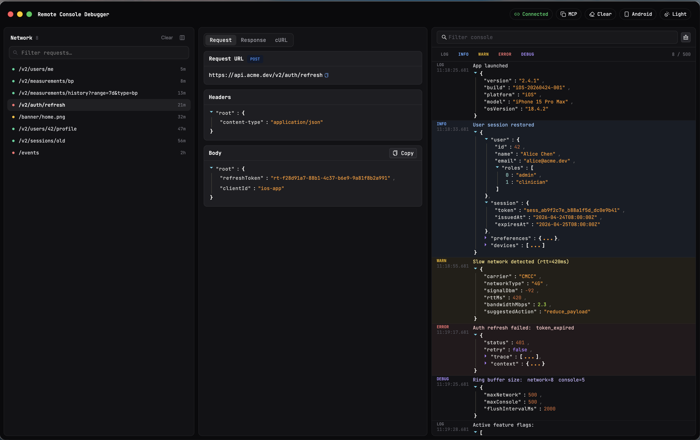

<div align="center">
  <table border="0" cellspacing="0" cellpadding="0">
    <tr>
      <td></td>
      <td><h1>RN Remote Debugger</h1></td>
    </tr>
  </table>
</div>

<p align="center">
  <a href="README.md">English</a> •
  <a href="README.zh-CN.md">简体中文</a> •
  <a href="README.ja.md">日本語</a>
</p>

<p align="center">
  <a href="https://www.npmjs.com/package/rn-remote-debugger"></a>
  <a href="https://www.npmjs.com/package/rn-remote-debugger"></a>
  <a href="https://github.com/niceyoo/rn-remote-debugger/blob/main/LICENSE"></a>
</p>

<p align="center">
  
</p>

---

## 为什么做这个项目？

自从 React Native 使用了 Hermes 引擎以后，React Native Debugger 不再可用，尤其是在使用一些动画库的时候。我想看到网络请求，我想像在 Chrome 一样查看日志，所以诞生了这个项目。希望对所有人有所帮助！

---

## 快速开始

### 第一步：下载桌面应用

从 [Releases](https://github.com/niceyoo/rn-remote-debugger/releases) 下载并安装 DMG。

### 第二步：安装 npm 包

```bash
yarn add rn-remote-debugger
```

### 第三步：生成配置文件

```bash
npx rn-remote-debugger-create
```

这会在项目根目录生成 `rn-remote-debug.js` 文件：

```javascript
if (__DEV__) {
  module.exports = {
    host: '192.168.1.100', // 你的电脑 IP（自动检测）
    port: 8989,
    enableConsole: true,
    enableNetwork: true
  }
} else {
  module.exports = {}
}
```

> **iOS 注意**：确保 `host` 与你电脑的 IP 地址一致。

### 第四步：在入口文件中引入

在 React Native 项目的 `index.js` 顶部添加：

```javascript
import initRemoteDebugger from 'rn-remote-debugger'

initRemoteDebugger({})
```

完成！调试器会自动连接。

---

## 平台注意事项

### Android

在启动应用前运行：

```bash
adb reverse tcp:8989 tcp:8989
```

### iOS

无需额外配置。只需确保配置文件中的 IP 地址与电脑 IP 一致。

---

## 配置优先级

**配置文件 > 代码参数**

生成的 `rn-remote-debug.js` 文件优先级高于代码中传入的参数。

---

## License

[MIT](LICENSE)
