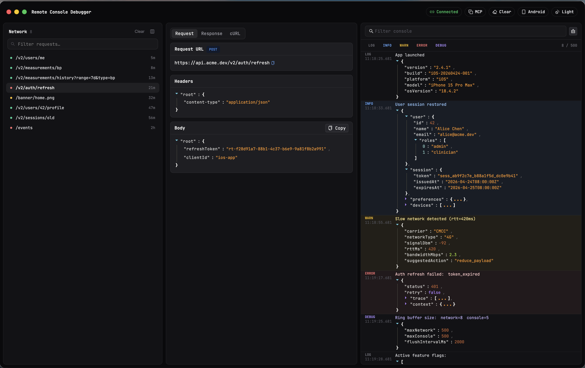

<div align="center">
  
  <h1>RN Remote Debugger</h1>
</div>

<p align="center">
  <a href="README.md">English</a> •
  <a href="README.zh-CN.md">简体中文</a> •
  <a href="README.ja.md">日本語</a>
</p>

<p align="center">
  <a href="https://www.npmjs.com/package/rn-remote-debugger"></a>
  <a href="https://www.npmjs.com/package/rn-remote-debugger"></a>
  <a href="https://github.com/yinminqian/rn-remote-debugger/blob/main/LICENSE"></a>
</p>

<p align="center">
  
</p>

---

## 为什么做这个项目？

自从 React Native 使用了 Hermes 引擎以后，React Native Debugger 不再可用，尤其是在使用一些动画库的时候。我想看到网络请求，我想像在 Chrome 一样查看日志，所以诞生了这个项目。希望对所有人有所帮助！

---

## 快速开始

### 第一步：下载桌面应用

前往 [Releases 页面](https://github.com/yinminqian/rn-remote-debugger/releases/latest) 下载最新 DMG：

| 机器 | 文件 |
| --- | --- |
| Apple Silicon（M1/M2/M3/M4） | `RN-Remote-Debugger-<version>-arm64.dmg` |
| Intel | `RN-Remote-Debugger-<version>.dmg` |

**首次启动（一次性）**：DMG 未做 Apple 签名，macOS Gatekeeper 会拦一次。

1. 打开 DMG → 把 **RN Remote Debugger** 拖到 `Applications` 文件夹。
2. 双击 **首次启动修复.command**（就在同一个 DMG 里）。若被系统拦截，**右键 → 打开 → 确认**即可。
3. 之后就能正常双击启动了。

<details>
<summary>偏好命令行？</summary>

```bash
xattr -cr "/Applications/RN Remote Debugger.app"
```

</details>

### 第二步：安装 npm 包

```bash
yarn add rn-remote-debugger
```

### 第三步：生成配置文件

```bash
npx rn-remote-debugger-create
```

这会在项目根目录生成 `rn-remote-debug.js` 文件：

```javascript
if (__DEV__) {
  module.exports = {
    host: '192.168.1.100', // 你的电脑 IP（自动检测）
    port: 8989,
    enableConsole: true,
    enableNetwork: true
  }
} else {
  module.exports = {}
}
```

> **iOS 注意**：确保 `host` 与你电脑的 IP 地址一致。

### 第四步：在入口文件中引入

在 React Native 项目的 `index.js` 顶部添加：

```javascript
import initRemoteDebugger from 'rn-remote-debugger'

initRemoteDebugger({})
```

完成！调试器会自动连接。

---

## AI 调试（MCP）

桌面应用内置了一个本地 **MCP（Model Context Protocol）** 端点，Claude Code（或任何支持 MCP 的客户端）可以直接读取 RN 的日志和网络请求 —— 再也不用把 curl 命令或日志截图贴到聊天里了。

调试器运行时端点就在线（默认 `http://localhost:8989/mcp`；端口被占会自动往后递增 —— 点标题栏上的 **MCP** 按钮可以一键复制实际地址）。

### 添加到 Claude Code

```bash
claude mcp add rn-debug --transport http http://localhost:8989/mcp
```

### 可用工具

| 工具 | 用途 |
| --- | --- |
| `list_network_requests` | 最近请求摘要 —— 支持 `method` / `urlPattern` / `status` / `since` 过滤 |
| `get_network_request` | 单条请求完整详情：headers + 请求体 + 响应体 |
| `list_console_logs` | 最近 console 日志 —— 支持 `level` / `textPattern` / `since` 过滤 |
| `search` | 跨日志与请求做大小写无关子串搜索 |
| `clear` | 清空所有缓冲 |

现在可以直接问 Claude：**"最近一次失败的请求是什么？"**、**"把最新那个 `/login` 的返回值打出来"**、**"给我看过去一分钟的 error 日志"**，它会自己去拉数据。

> 数据只在桌面应用运行期间存在；环形缓冲区保留最近约 200 条请求和 500 条日志。

---

## 平台注意事项

### Android

在启动应用前运行：

```bash
adb reverse tcp:8989 tcp:8989
```

### iOS

无需额外配置。只需确保配置文件中的 IP 地址与电脑 IP 一致。

---

## 配置优先级

**配置文件 > 代码参数**

生成的 `rn-remote-debug.js` 文件优先级高于代码中传入的参数。

---

## License

[MIT](LICENSE)
